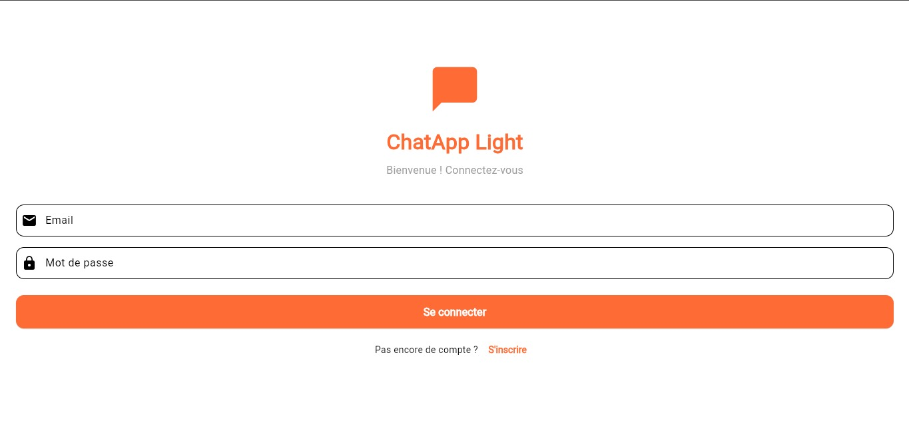
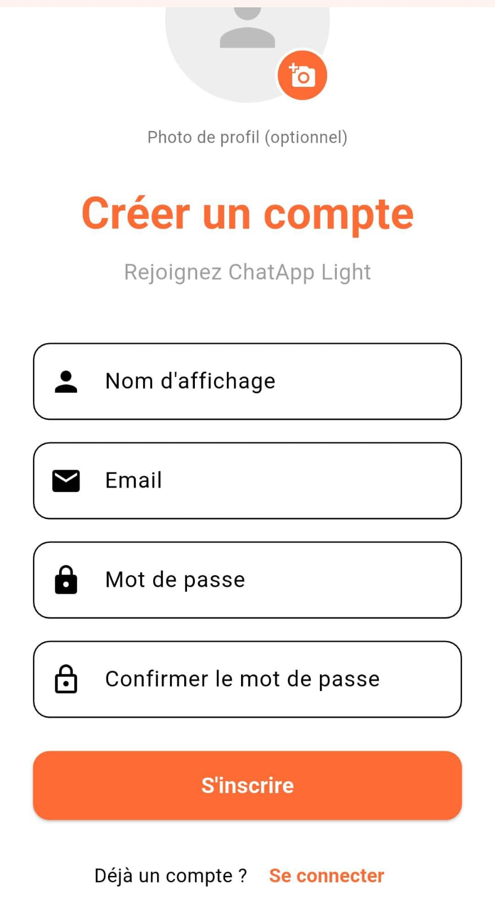
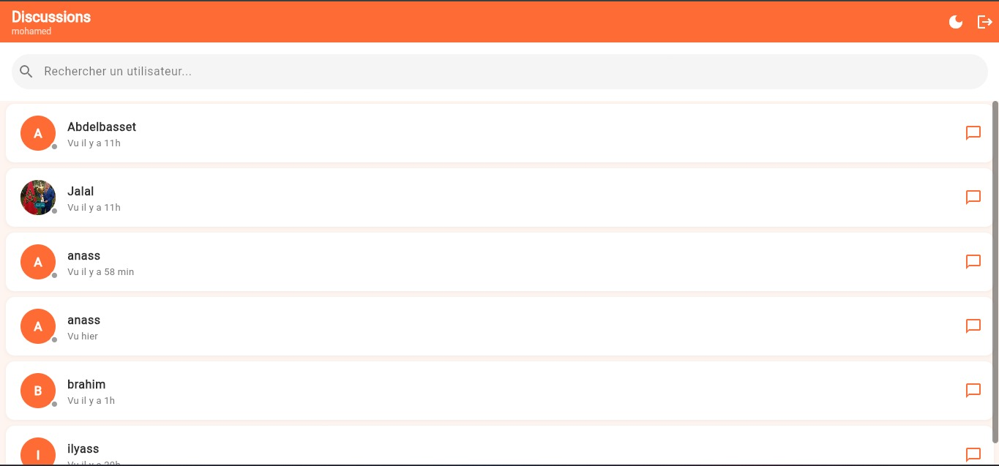
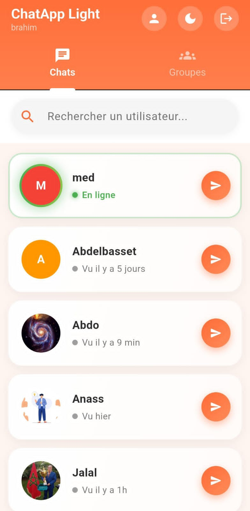
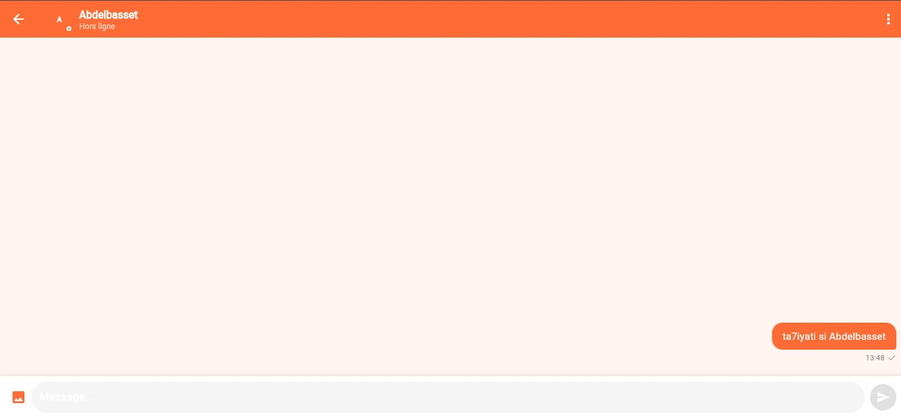
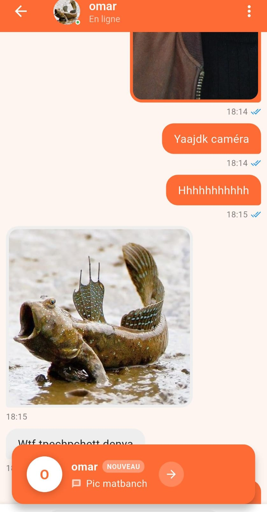

# ChatApp Light 💬

Application mobile de messagerie instantanée simple et légère, permettant à des utilisateurs de discuter en temps réel grâce aux services **Firebase**. Développée avec **Flutter** et disponible sur Android, iOS, Web, macOS, Windows et Linux.

---


## 📱 Aperçu de l'application

### Connexion & Inscription

L'écran de connexion adopte un design épuré centré sur la marque — logo orange, champs email/mot de passe et lien vers l'inscription. Sur mobile, l'écran d'inscription permet également d'ajouter une photo de profil optionnelle dès la création du compte.

| Web / Desktop | Mobile |
|:---:|:---:|
|  |  |
| Connexion — version web | Création de compte — version mobile |

---

### Liste des conversations

La vue principale affiche tous les utilisateurs avec leur statut de présence en temps réel (en ligne / vu il y a X min). Sur desktop, une barre de recherche permet de filtrer rapidement. Sur mobile, une navigation par onglets sépare les **Chats** individuels des **Groupes**, avec un indicateur visuel vert pour les contacts en ligne.

| Web / Desktop | Mobile |
|:---:|:---:|
|  |  |
| Liste des discussions — version web | Chats & Groupes — version mobile |

---

### Écran de chat

L'interface de chat affiche les messages sortants en bulles orange (à droite) et les messages entrants en fond clair (à gauche), avec horodatage et indicateur de lecture (✓✓). Le partage d'images est intégré nativement. Une bannière de notification apparaît en bas lors de la réception d'un nouveau message pendant la conversation.

| Web / Desktop | Mobile |
|:---:|:---:|
|  |  |
| Conversation — version web | Conversation avec partage d'image — version mobile |


## 🚀 Fonctionnalités

- **Authentification** — inscription et connexion via Firebase Auth
- **Messagerie temps réel** — envoi et réception instantanés via Cloud Firestore
- **Liste des conversations** — affichage dynamique avec aperçu et badges non lus
- **Interface légère** — design épuré et performant
- **Multi-plateforme** — Android, iOS, Web, macOS, Windows, Linux

---

## 🏗️ Architecture du projet

```
chatapp_light/
├── lib/
│   ├── main.dart          # Point d'entrée de l'application
│   ├── models/            # Modèles de données (User, Message…)
│   ├── views/             # Écrans (Login, Home, Chat…)
│   ├── widgets/           # Composants réutilisables
│   ├── providers/         # Gestion d'état (Provider)
│   ├── services/          # Services Firebase (Auth, Firestore…)
│   └── utils/             # Utilitaires et helpers
├── android/               # Configuration Android
├── ios/                   # Configuration iOS
├── web/                   # Configuration Web
├── macos/                 # Configuration macOS
├── windows/               # Configuration Windows
└── linux/                 # Configuration Linux
```

---

## 🛠️ Installation

### Prérequis

- [Flutter SDK](https://docs.flutter.dev/get-started/install) ≥ 3.18.0
- Dart ≥ 3.9.2
- Un projet Firebase configuré (Authentication + Firestore)

### 1. Cloner le dépôt

```bash
git clone https://github.com/votre-utilisateur/chatapp_light.git
cd chatapp_light
```

### 2. Configurer Firebase

#### Android
1. Téléchargez `google-services.json` depuis la [console Firebase](https://console.firebase.google.com)
2. Placez-le dans `android/app/google-services.json`
3. Ce fichier est exclu du dépôt — ne le commitez jamais

#### iOS
1. Téléchargez `GoogleService-Info.plist` depuis la console Firebase
2. Placez-le dans `ios/Runner/GoogleService-Info.plist`
3. Ce fichier est exclu du dépôt — ne le commitez jamais

### 3. Installer les dépendances

```bash
flutter pub get
```

### 4. Lancer l'application

```bash
# Android / iOS (émulateur ou appareil connecté)
flutter run

# Web
flutter run -d chrome

# macOS
flutter run -d macos
```

---

## 📦 Dépendances principales

| Package | Version | Usage |
|---|---|---|
| `flutter` | SDK | Framework UI |
| `cupertino_icons` | ^1.0.8 | Icônes iOS |
| `firebase_core` | à ajouter | Initialisation Firebase |
| `firebase_auth` | à ajouter | Authentification |
| `cloud_firestore` | à ajouter | Base de données temps réel |
| `provider` | à ajouter | Gestion d'état |

---

## 🧪 Tests

```bash
# Tests unitaires et widgets
flutter test

# Avec couverture de code
flutter test --coverage
```

---

## 📋 Configuration des plateformes

| Plateforme | Détails |
|---|---|
| Android | JVM 11, Gradle 8.12 |
| iOS | Déploiement minimum iOS 13.0 |
| macOS | Déploiement minimum macOS 10.15, Sandbox activé |
| Windows | DPI-aware PerMonitorV2, Windows 10/11 |
| Web | PWA, manifest inclus |
| Linux | GTK 3, application GNOME-compatible |

---

## 🔧 Développement

### Conventions de code

```bash
# Analyser le code
flutter analyze

# Formater le code
dart format .
```

### Structure des services Firebase

```
lib/services/
├── auth_service.dart    # Inscription, connexion, déconnexion
├── chat_service.dart    # Envoi et écoute des messages en temps réel
└── user_service.dart    # Profil et données utilisateur
```

---

## 🤝 Contribution

1. Forkez le projet
2. Créez une branche : `git checkout -b feature/ma-fonctionnalite`
3. Commitez : `git commit -m 'feat: ajouter ma fonctionnalité'`
4. Poussez : `git push origin feature/ma-fonctionnalite`
5. Ouvrez une Pull Request

---

## 📚 Ressources

- [Documentation Flutter](https://docs.flutter.dev)
- [Documentation Firebase](https://firebase.google.com/docs)
- [Package Provider](https://pub.dev/packages/provider)
- [Flutter Cookbook](https://docs.flutter.dev/cookbook)

---

## 📄 Licence

Ce projet est sous licence MIT.

---

*Développé avec Flutter ❤️*
